# Multi-Omics Tumor Subtyping using MOFA + Similarity Network Fusion (SNF)

### CPTAC Pancreatic Ductal Adenocarcinoma (CPTAC-PDAC)


---

## Author

**Assistant Lecturer:** Shorouf Aldiarabi
Faculty of Science, Port Said University, Egypt

---

## Overview

This project implements a **multi-omics integration pipeline** to identify tumor molecular subtypes in CPTAC PDAC.

The pipeline integrates:

* MOFA latent factor analysis
* Multi-omics feature selection
* Similarity Network Fusion (SNF)
* Spectral clustering
* Functional enrichment analysis

---

## Pipeline Workflow

<p align="center">
  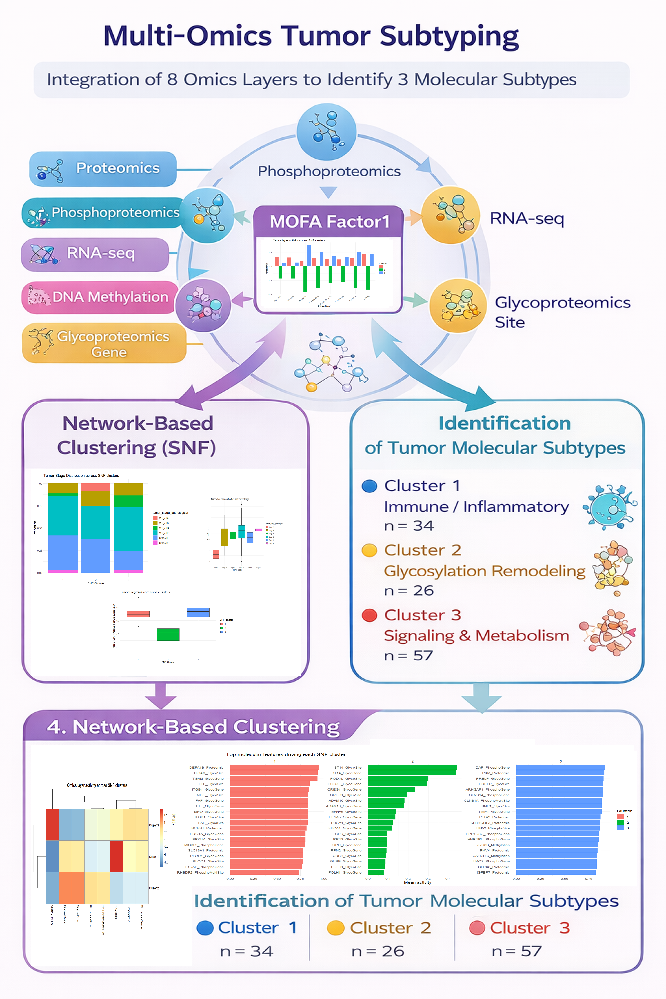
</p>

---

## Objectives

* Extract tumor programs using MOFA
* Identify key multi-omics features
* Integrate omics layers using SNF
* Detect molecular tumor subtypes
* Characterize biological mechanisms

---

## Results Summary

### Tumor Subtypes

| Cluster   | Biological Theme       | Interpretation       |
| --------- | ---------------------- | -------------------- |
| Cluster 1 | Immune / Inflammatory  | Immune-rich subtype  |
| Cluster 2 | Glycosylation          | Invasive subtype     |
| Cluster 3 | Signaling & Metabolism | Active tumor program |

---

## Figures

---

### Cluster Composition

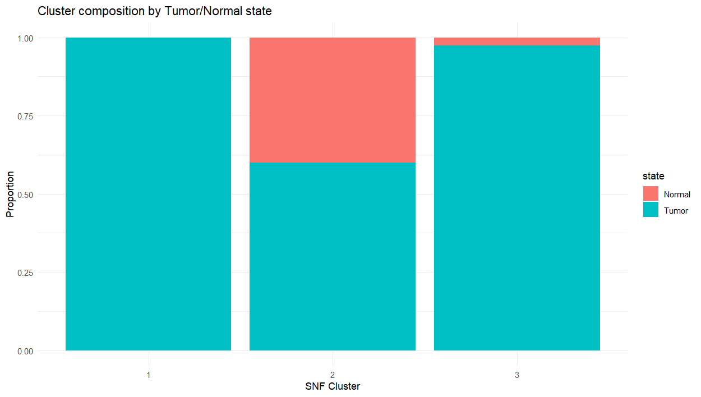

---

### Tumor Stage Distribution

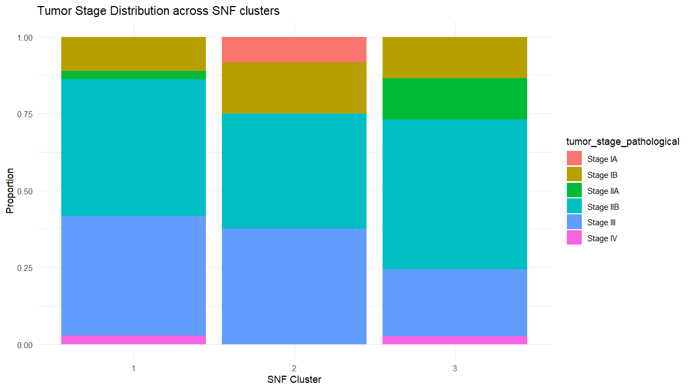

---

### Tumor Stage vs Clusters (Alternative View)

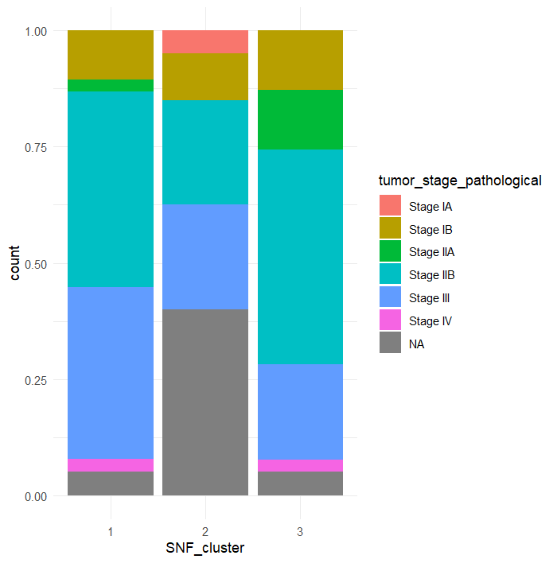

---

### Tumor Program Score

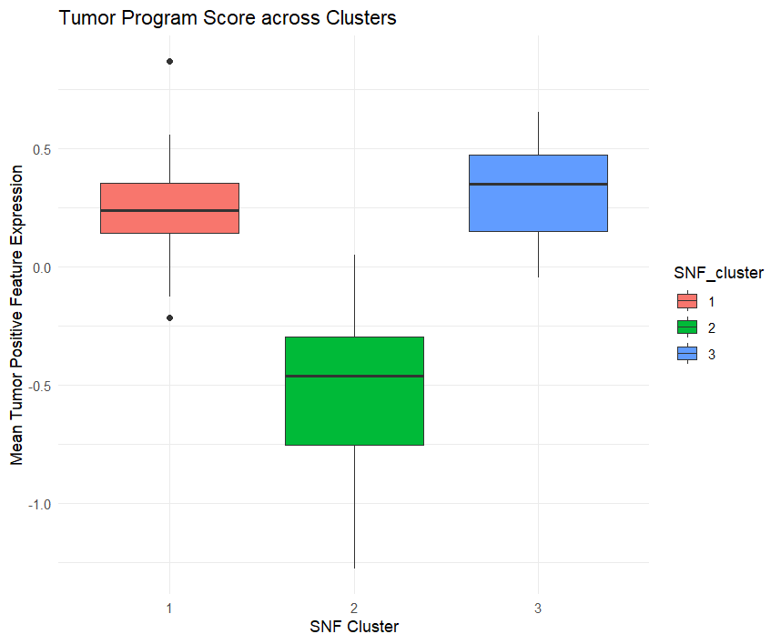

---

### Factor1 vs Tumor Stage

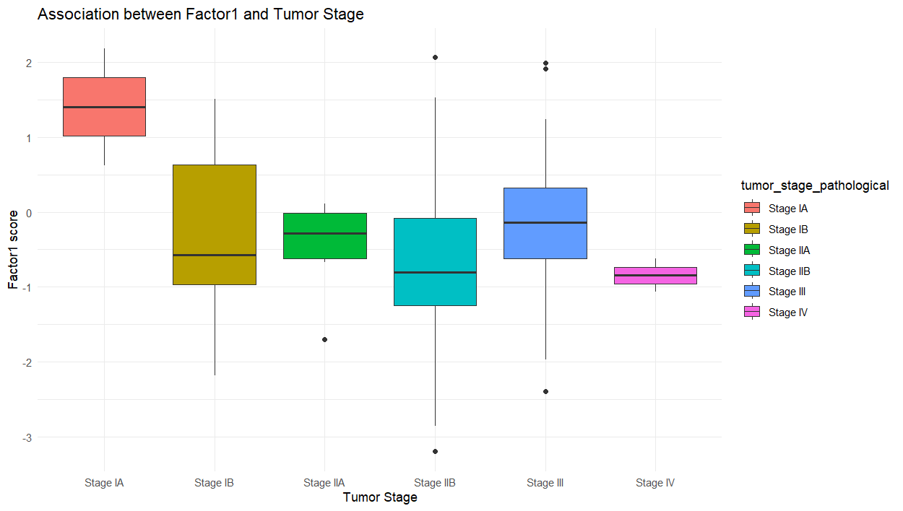

---

### Omics Layer Activity

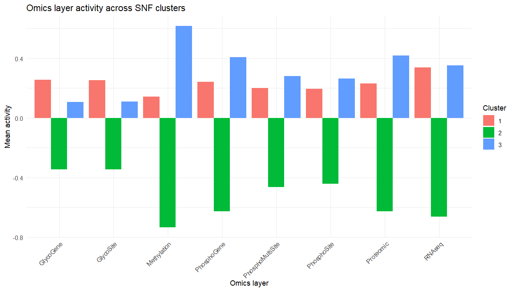

---

### SNF Heatmap

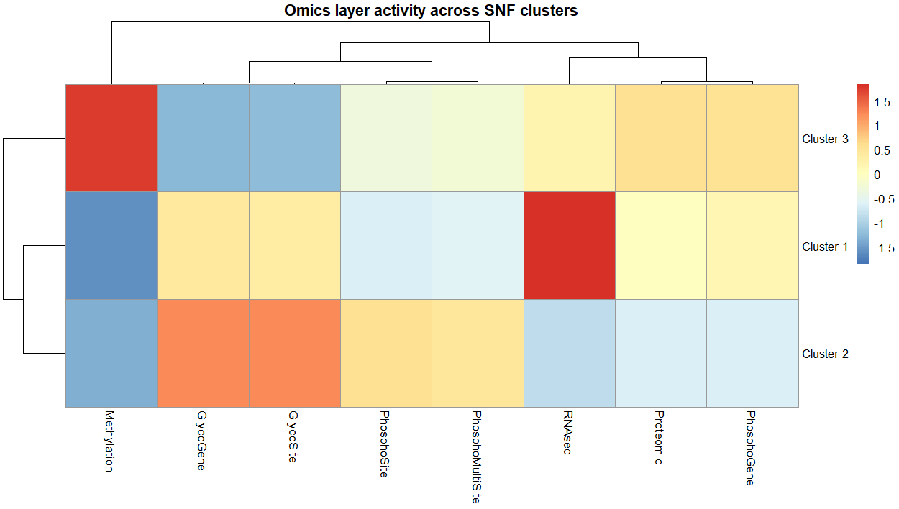

---

### Feature Heatmap (Key Drivers)

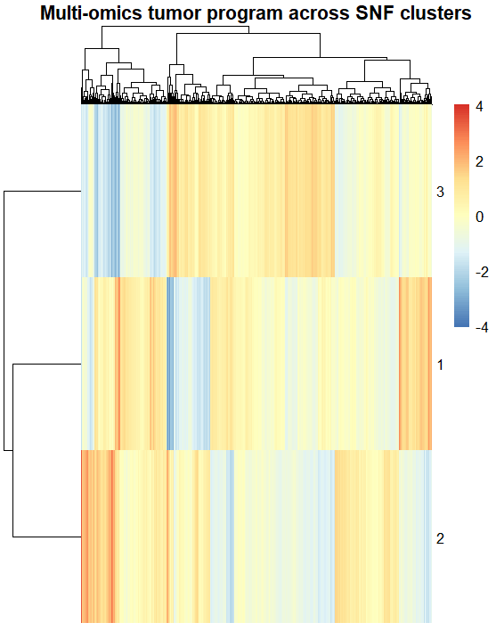

---

### Top Features Driving Clusters

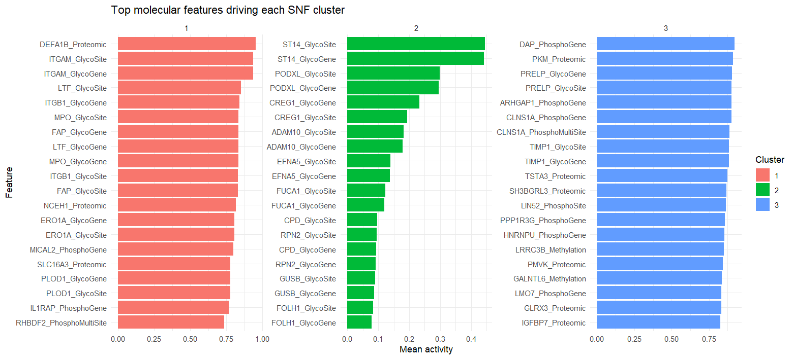

---

### GO Enrichment (Dotplot)

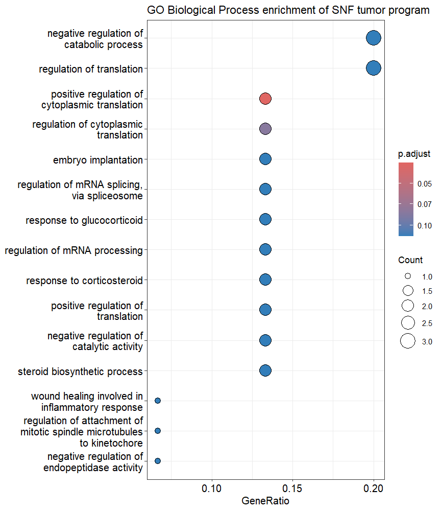

---

### GO Enrichment (Barplot)

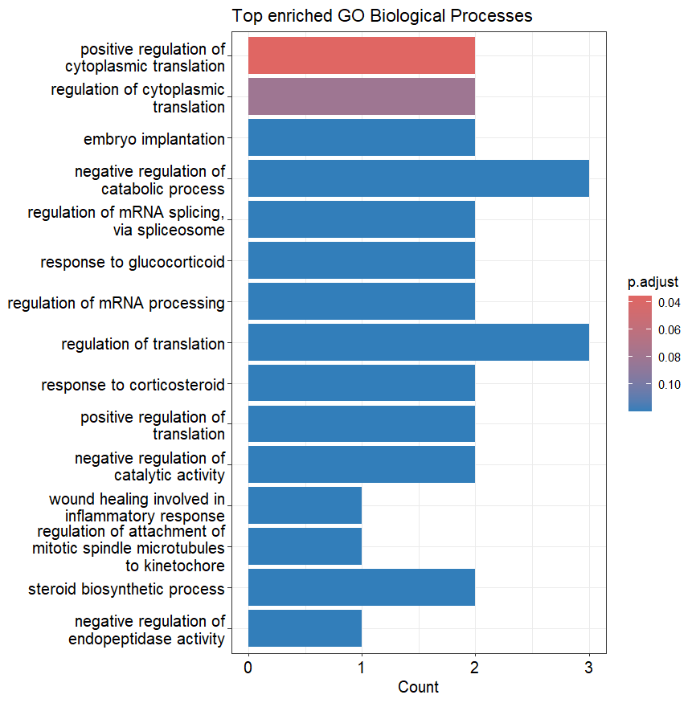

---

## Project Structure

```
SNF-ANALYSIS/
├── Figures/
├── Script/
│   ├── Data/
│   ├── TOP-FEATURES/
│   └── SNF-ANALYSIS.R
```

---

## How to Run

```r
source("Script/SNF-ANALYSIS.R")
```

---

## Requirements

```r
MOFA2
SNFtool
tidyverse
clusterProfiler
enrichplot
pathview
pheatmap
```

---

## License

Academic use only.

